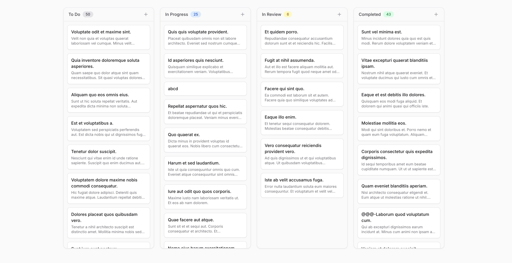

# Flowforge - Laravel Filament Kanban Board

[](https://packagist.org/packages/relaticle/flowforge)
[](https://php.net)
[](https://laravel.com)
[](https://filamentphp.com)
[](https://packagist.org/packages/relaticle/flowforge)
[](LICENSE.md)

Flowforge is a powerful Kanban board package for Laravel Filament 3 that works seamlessly with your existing Eloquent models. This package allows you to transform any model into a Kanban board with minimal configuration, without requiring additional database tables.



> [!IMPORTANT]
> This package is a work in progress and is not yet ready for production use. It is currently in the alpha stage and may have bugs or incomplete 
features.

## Features

Flowforge offers several powerful features out of the box:

- **Drag and Drop**: Move cards between columns or reorder them within a column
- **Create Cards**: Add new cards directly from the board interface
- **Edit Cards**: Modify existing cards with a simple click
- **Responsive Design**: Works on all device sizes
- **Real-time Updates**: Changes are reflected immediately
- **Custom Card Actions**: Add your own actions to cards (coming soon)
- **Filter and Search**: Find cards quickly (coming soon)

## Requirements

- PHP 8.3+
- Laravel 11+
- Filament 3.x

## Installation

You can install the package via composer:

```bash
composer require relaticle/flowforge
```

After installation, the package should work without any additional configuration. However, for the drag-and-drop feature to persist order, your model should have a field for storing the order (typically an integer column).

## Model Preparation

To fully utilize Flowforge, your model should have:

1. A field for the card title (e.g., `title`, `name`)
2. A field for the column/status (e.g., `status`, `state`)
3. Optionally, a field for description (e.g., `description`, `content`)
4. Optionally, a field for order (e.g., `order_column`, `sort_order`)

Example migration:

```php
Schema::create('tasks', function (Blueprint $table) {
    $table->id();
    $table->string('title');
    $table->text('description')->nullable();
    $table->string('status')->default('todo');
    $table->integer('order_column')->nullable();
    $table->timestamps();
});
```

## Board Generation

You can easily create a new Kanban board page using the provided command:

```bash
php artisan flowforge:make-board TasksBoard --model=Task
```

This will generate a new Filament page configured for your model. The command accepts the following options:
- `name`: The name of the board page (required, can be provided as argument or prompted)
- `--model` or `-m`: The model class to use (required, will be prompted if not provided)
- `--panel` or `-p`: The Filament panel name (optional, leave empty for default Filament structure)

By default, the command will create the board page in your default Filament structure (`app/Filament/Pages/`). If you're using a multi-panel setup, you can specify the panel name to place the board in the correct directory.

## Basic Usage

To create a Kanban board for your model, create a new Filament page that extends `KanbanBoardPage`:

```php
<?php

namespace App\Filament\Pages;

use App\Models\Task;
use Illuminate\Database\Eloquent\Builder;
use Relaticle\Flowforge\Filament\Pages\KanbanBoardPage;

class TasksBoardPage extends KanbanBoardPage
{
    protected static ?string $navigationIcon = 'heroicon-o-view-columns';
    protected static ?string $navigationParentItem = 'Tasks';

    public function mount(): void
    {
        $this
            ->titleField('title')
            ->columnField('status')
            ->descriptionField('description')
            ->orderField('order_column')
            ->columns([
                'todo' => 'To Do',
                'in_progress' => 'In Progress',
                'review' => 'In Review',
                'done' => 'Completed',
            ])
            ->columnColors([
                'todo' => 'gray',
                'in_progress' => 'blue',
                'review' => 'yellow',
                'done' => 'green',
            ]);
    }

    protected function getSubject(): Builder
    {
        return Task::query();
    }
}
```

## Configuration Options

You can customize your Kanban board using these configuration methods:

- `titleField(string)`: Field used for card titles
- `descriptionField(string)`: Field used for card descriptions
- `columnField(string)`: Field used to determine which column a card belongs to
- `orderField(string)`: Field used to maintain card order (requires a sortable model)
- `columns(array)`: Key-value pairs defining columns (key as identifier, value as display label)
- `columnColors(array)`: Key-value pairs defining colors for each column
- `cardLabel(string)`: Custom label for cards (defaults to model name)

### Available Column Colors

Flowforge uses Tailwind CSS color classes. The available color options are:
- `gray`
- `red`
- `orange`
- `yellow`
- `green`
- `teal`
- `blue`
- `indigo`
- `purple`
- `pink`

## Custom Adapters

For more complex scenarios, you can create a custom adapter by extending `DefaultKanbanAdapter`:

```php
<?php

namespace App\Adapters;

use App\Models\Opportunity;
use Filament\Forms;
use Filament\Forms\Form;
use Illuminate\Database\Eloquent\Builder;
use Illuminate\Database\Eloquent\Model;
use Illuminate\Support\Collection;
use Relaticle\Flowforge\Adapters\DefaultKanbanAdapter;
use Relaticle\Flowforge\Contracts\KanbanAdapterInterface;

class OpportunitiesKanbanAdapter extends DefaultKanbanAdapter
{
    // Customize forms
    public function getCreateForm(Form $form, mixed $currentColumn): Form
    {
        return $form->schema([
            Forms\Components\TextInput::make('title')
                ->required()
                ->placeholder('Enter opportunity title')
                ->columnSpanFull(),
            // Add more form fields as needed
        ]);
    }

    // Custom create logic
    public function createRecord(array $attributes, mixed $currentColumn): ?Model
    {
        // Custom creation logic
        $opportunity = Opportunity::create($attributes);
        
        // Set the column/status value
        $opportunity->status = $currentColumn;
        $opportunity->save();
        
        return $opportunity;
    }
}
```

Then in your page class, override the `getAdapter()` method:

```php
public function getAdapter(): KanbanAdapterInterface
{
    return new OpportunitiesKanbanAdapter($this->getSubject(), $this->config);
}
```

## Integration with Custom Fields

Flowforge can be integrated with custom field systems, as shown in the Opportunities board example:

```php
class OpportunitiesBoardPage extends KanbanBoardPage
{
    public function mount(): void
    {
        $columns = $this->stageCustomField()->options->pluck('name', 'id');
        $columnColors = OpportunityStage::getColors();

        $this
            ->titleField('title')
            ->columnField('status')
            ->descriptionField('description')
            ->orderField('order_column')
            ->cardLabel('Opportunity')
            ->columns($columns->toArray())
            ->columnColors($columns->map(fn($name) => $columnColors[$name] ?? 'gray')->toArray());
    }

    // Use a custom adapter
    public function getAdapter(): KanbanAdapterInterface
    {
        return new OpportunitiesKanbanAdapter(Opportunity::query(), $this->config);
    }
}
```

## Troubleshooting

### Common Issues

- **Cards not draggable**: Ensure your model has an order field and you've specified it with `orderField()`
- **Empty board**: Check that your model has records with the column values specified in your `columns()` configuration
- **Column not showing**: Verify that your column keys in the `columns()` method match the values stored in your database

If you encounter any bugs or have feature requests, please open an issue on the GitHub repository.

## Contributing

Contributions are welcome! Please feel free to submit a Pull Request.

## License

The MIT License (MIT). Please see [License File](LICENSE.md) for more information.